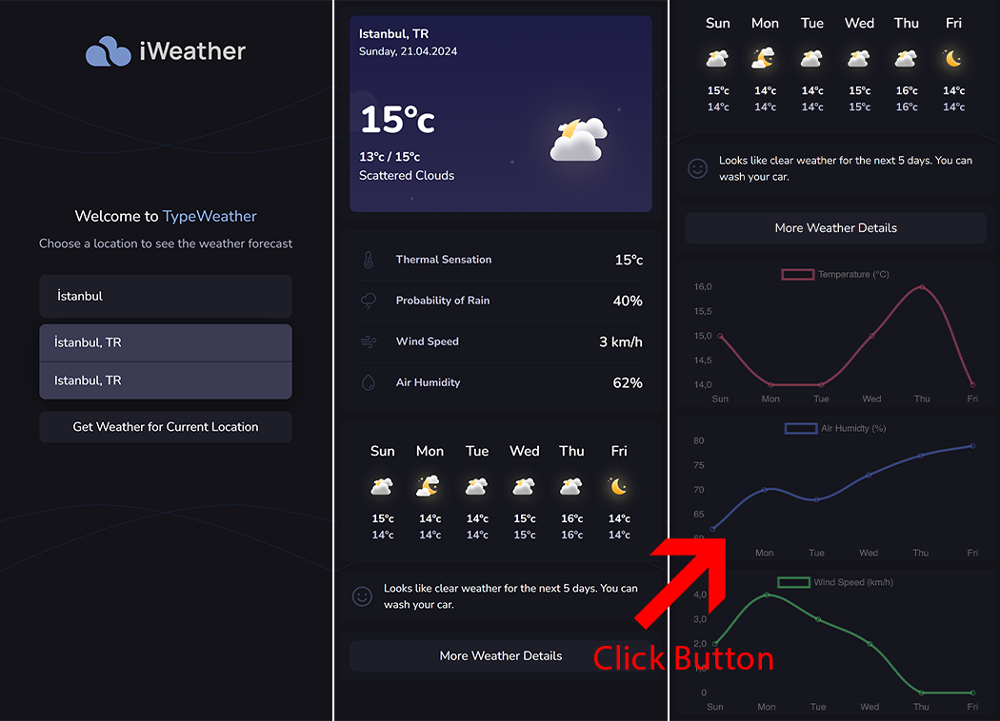

# iWeather

## Kullanılan Teknolojiler

- React
- React Router
- Tailwind CSS
- OpenWeatherMap API

## Ekran Görüntüleri

## Kurulum

1. Projeyi bilgisayarınıza indirin veya repoyu klonlayın. https://github.com/aliozsoy1/weather-app-staj.git
2. Terminalde proje dizinine gidin.
3. `npm install` komutunu çalıştırarak bağımlılıkları yükleyin.
4. `npm run dev` komutunu çalıştırarak uygulamayı başlatın.

## Ayrıca Teşekkürler

Zafer hocama bu fikri verdiği için teşekkürler :)

