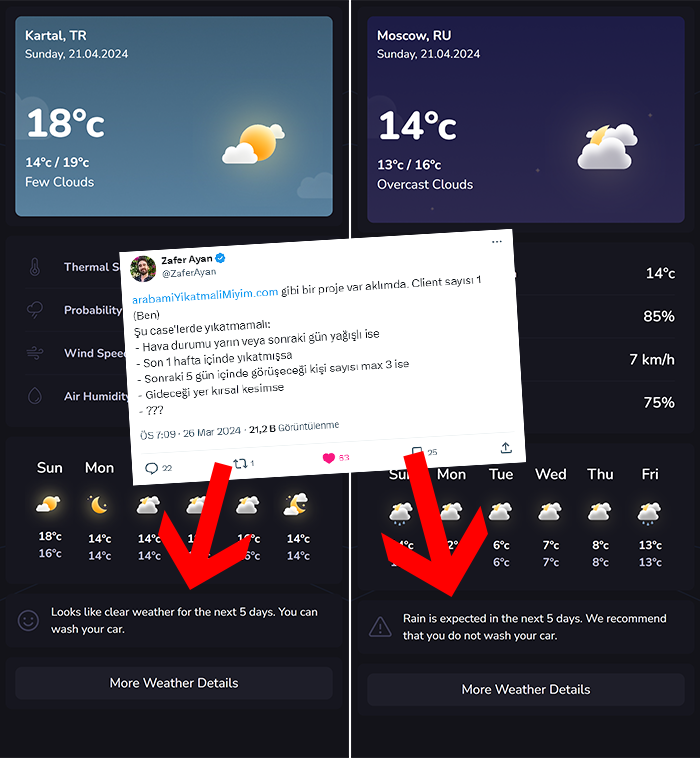

# iWeather

## Kullanılan Teknolojiler

- React + Vite
- React Router
- Tailwind CSS
- OpenWeatherMap API
- ChartJs
- Tailwindcss Animated

## Ana Özellikler

- Şehir/İlçe ismi girilerek arama yapılabilmektedir.
- Get Weather for Current Location butonu ile konum alınıp bu alınan konuma göre hava durumu görüntülenebilmektedir.
- 5 Günlük hava durumu kontrol edilerek araba yıkayıp yıkamama uyarısı veriliyor.
- More Weather Details butonu basıldığında grafikler açılmaktadır.

## Ekran Görüntüleri

## Demo

https://aliozsoy1.github.io/weather-app-staj/745042

## Kurulum

1. Projeyi bilgisayarınıza indirin veya repoyu klonlayın. https://github.com/aliozsoy1/weather-app-staj.git
2. Terminalde proje dizinine gidin.
3. `npm install` komutunu çalıştırarak bağımlılıkları yükleyin.
4. `npm run dev` komutunu çalıştırarak uygulamayı başlatın.

## Ayrıca Teşekkürler

Zafer hocama bu fikri verdiği için teşekkürler :)

